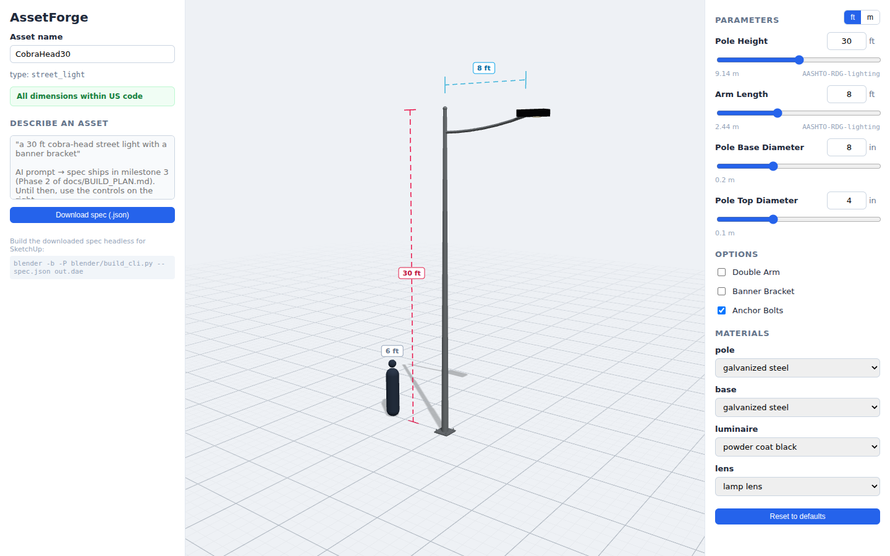

# AssetForge

AI parametric asset generator: prompt → parametric spec → live 3D preview →
US-code-validated dimensions → headless Blender build → `.blend`/`.dae`/`.obj`/`.glb`/`.fbx`
export for Blender, SketchUp, and animation pipelines.



The full roadmap lives in [`docs/BUILD_PLAN.md`](docs/BUILD_PLAN.md). Shipped so far:

- **Milestone 1 — headless proof**: shared schemas, US-code standards DB +
  validator, builder registry, `street_light` builder, CLI harness.
- **Milestone 2 — live preview**: sliders, toggles, material controls, code
  violations in red with citations + "snap to code", human silhouette and
  dimension callouts for scale.
- **Milestone 3 — the AI**: describe **any** asset in plain English
  ("a 6 ft park bench with a backrest", "an art-deco pedestrian lamp with a
  glowing acorn globe") and keep refining it conversationally ("make it
  bronze", "add armrests"). Known asset types use hand-tuned builders; for
  everything else the AI models the geometry itself as parametric primitives
  whose dimensions stay wired to the sliders. Materials are fully editable —
  per-part color, reflection (metalness), roughness, UV tiling, and glow —
  by slider *or* by prompt.

- **Milestone 3.5 — the editor**: click any part in the 3D view to edit just
  that part (position nudges, dimensions, group stats), a one-click
  bolts-and-nuts connection view, an AI installation guide, an AI-powered
  standards-DB updater that can commit straight to GitHub, and dark mode.

**Not built yet**: one-click `.dae`/`.blend` download from the browser (needs
the Blender worker, milestone 4). Until then the export is one copy-paste
command — see [Open your asset in Blender](#open-your-asset-in-blender-or-sketchup).

## The editor

- **Click any part** in the 3D view to select its group (click again to drill
  down to the individual part). The right panel then shows *only that
  selection*: part count, measured width/depth/height, and X/Y/Z position
  nudges for the whole group or the single part. Nudges are saved into the
  spec (`offsets`), so they carry through to the Blender/SketchUp export.
  For AI-generated custom assets, plain-number dimensions are directly
  editable; expression-driven ones stay bound to their sliders.
- **🔩 Show real bolts & connections** adds representative bolt/nut
  assemblies (hex heads and all) wherever two component groups meet — in the
  preview *and* in every export, since it's stored as a spec toggle. Joints
  are detected **after** your manual edits, so a part you move takes its
  hardware with it, and each physical junction gets exactly one joint (a
  pole meeting its base plate is one welded connection, not six bolts).
- **🔍 Check connections** audits every joint the way a fabricator checks a
  shop drawing: parts floating with no load path, geometry below grade,
  declared joints whose parts don't actually touch, bolts clamping a
  paper-thin sliver, hardware sticking into thin air, and fasteners buried
  inside unrelated parts where no wrench could reach. Each finding proposes
  a concrete fix (seat the part 14 mm into its support, raise it to grade,
  drop the dead declaration…) with a checkbox to include or skip it.
  **Nothing is applied without confirmation** — and *hovering* the Apply
  button first shows the result live in the 3D view (changed parts
  highlighted) plus a before → after list of every change, so you see
  exactly what you're approving before you click.
- **📋 Installation guide** has the AI write step-by-step installation
  instructions for the current asset — site prep, anchoring, assembly order
  using the actual component names and dimensions, torque notes, and a code
  compliance checklist citing the relevant standards. View it in-app or
  download it as Markdown.
- **🏛 Refresh US standards DB** asks the AI to review `standards/us_codes.json`
  against the latest published editions (MUTCD, ADA, IBC, AASHTO) and add
  missing asset types. The proposal is structurally validated, then either
  **committed straight to GitHub** (add a `GITHUB_TOKEN` environment variable
  on Vercel — a fine-grained token with *Contents: read & write* on this
  repo) or offered as a download to review and paste in manually. Honesty
  note: the proposal comes from the AI's knowledge of published standards,
  not a live web crawl — always review the cited sections.
- **🌙 Dark mode** — the moon/sun button next to the logo; your choice is
  remembered.
- **Navigation** — drag to orbit, **WASD** to move around (Q/E for down/up),
  plus a maps-style button column in the viewport: zoom, reset view, top
  view, a live compass (click it to face north), and a sun dial (click to
  rotate the sun — shadows follow). Clicking a part glides the camera to
  center it; turning on the bolts view tours every connection point in
  order before zooming back out.
- **Live AI feedback** — every AI action streams: a small pulsing card shows
  the model's output as it generates, so you always know it's working. The
  installation guide is cached per asset — reopening it is instant until the
  asset changes (or hit Regenerate).
- **Model picker** — an **AI model** dropdown in the describe area chooses the
  DeepSeek model used for generate/refine/focus: `deepseek-chat` (balanced,
  cheapest), `deepseek-v4-flash` (faster, lighter), or `deepseek-v4-pro`
  (most capable). Your choice is remembered. It only takes effect with the
  DeepSeek provider; other providers use their own model. The picked id is
  allowlisted server-side, so only those three can ever be sent.
- **Focus one area** — below the refine box, a second field that deep-details
  a single component ("the luminaire head — add a hinged door and reflector")
  while keeping every other part byte-identical. Use refine for broad changes,
  focus to zoom in on one area and make it much more detailed without
  disturbing the rest.

---

## How to run it — pick one option

### Option A — Vercel, nothing to install (recommended)

Vercel is a free hosting service that builds and publishes this app for you —
including the small Python API the AI feature uses. You only need a web
browser.

1. Open **[vercel.com/signup](https://vercel.com/signup)** and choose
   **Continue with GitHub**. Sign in with the GitHub account that owns this
   repository and authorize Vercel when asked.
2. On your Vercel dashboard, click **Add New… → Project**.
3. Find **blender** (this repository) in the list and click **Import**.
   - If it isn't listed, click **Adjust GitHub App Permissions**, grant
     Vercel access to the repository, and it will appear.
4. On the configuration screen, **change nothing** — the repository's
   `vercel.json` configures everything — and click **Deploy**.
5. After about a minute, click **Visit**. That URL is your app.

Every push to this repository redeploys your URL automatically — you never
repeat these steps.

### Turn on the AI (DeepSeek)

Without this step everything works except the "Describe any asset" box.
DeepSeek is a low-cost AI provider; a few dollars of credit lasts a long
time (a generation costs a fraction of a cent).

1. Go to **[platform.deepseek.com](https://platform.deepseek.com)**, create
   an account, add a small amount of credit (Billing → Top up), then open
   **API Keys** and click **Create API key**. Copy the key (it starts with
   `sk-`) — it is shown only once.
2. In Vercel, open your project → **Settings → Environment Variables** and
   add:
   - **Key:** `DEEPSEEK_API_KEY` — **Value:** the key you copied
3. Go to the **Deployments** tab, click the **⋯** menu on the newest
   deployment, and choose **Redeploy**.
4. Open your app URL — the prompt box now works. Type what you want, click
   **Generate**, then keep refining in the chat ("make the pole taller",
   "weathered bronze, rougher wood").

Other providers work too — set `LLM_PROVIDER` alongside the matching key
(`deepseek` is the default):

| `LLM_PROVIDER` | Key variable | Default model |
| --- | --- | --- |
| `deepseek` | `DEEPSEEK_API_KEY` | `deepseek-chat` |
| `openai` | `OPENAI_API_KEY` | `gpt-4o-mini` |
| `anthropic` | `ANTHROPIC_API_KEY` | `claude-sonnet-5` |
| `mock` | *(none — free demo mode, returns bundled examples)* | — |

Set `LLM_MODEL` to override the model. The AI's output is strictly
schema-checked, code-clamped, and test-built before it ever reaches your
browser. If it fails, the app *understands* the failure — a reply cut off
mid-JSON, a schema violation at a named field, an expression using an id
that doesn't exist, a part left floating, a provider hiccup — and retries
with a targeted correction (and the full error history) up to 3 attempts
before giving up; the live stream shows each attempt as it happens.

### Option B — Run on your own computer (one install)

1. Install **Node.js**: at [nodejs.org](https://nodejs.org), click the green
   **LTS** button and run the installer with every default.
2. On this repository's GitHub page, click **Code → Download ZIP** and unzip
   it somewhere easy (e.g. your Desktop).
3. Open a terminal (Windows: Windows key, type `cmd`, Enter · Mac: ⌘-space,
   type `Terminal`, Enter) and run, adjusting the first path:

   ```
   cd Desktop/blender-main/frontend
   npm install
   npm run dev
   ```

4. Open **http://localhost:5173**. For the AI locally you also need Python:
   `pip install -r backend/requirements.txt`, then in a second terminal from
   the repo folder:

   ```
   set DEEPSEEK_API_KEY=sk-...        (Windows)   |   export DEEPSEEK_API_KEY=sk-...   (Mac)
   python -m uvicorn backend.app.main:app --port 8000
   ```

### Option C — Full stack (for developers)

```bash
pip install pytest && pytest                     # 60 tests: validator, builders, expression sandbox, API
python3 blender/build_cli.py examples/park_bench.json out/prims.json   # no Blender needed
docker compose up --build backend                # API + Postgres + Redis
LLM_PROVIDER=mock uvicorn backend.app.main:app   # keyless AI demo mode
```

---

## Open your asset in Blender (or SketchUp)

The web preview is an approximation; the *real* geometry is built by Blender
from the same spec. Here's how to get a proper Blender object from what you
made in the browser:

1. **Install Blender** (free): [blender.org/download](https://www.blender.org/download),
   run the installer with defaults.
2. **In the web app, click "Download spec (.json)"** — save it somewhere
   easy, e.g. your Desktop.
3. **Get this repository's files** (once): GitHub → **Code → Download ZIP**,
   unzip to your Desktop.
4. **Run one command** in a terminal, from inside the unzipped folder:

   **Mac** (Terminal):
   ```
   cd Desktop/blender-main
   /Applications/Blender.app/Contents/MacOS/Blender -b -P blender/build_cli.py -- ~/Desktop/MyAsset.json ~/Desktop/MyAsset.blend
   ```

   **Windows** (Command Prompt):
   ```
   cd Desktop\blender-main
   "C:\Program Files\Blender Foundation\Blender 4.5\blender.exe" -b -P blender/build_cli.py -- %USERPROFILE%\Desktop\MyAsset.json %USERPROFILE%\Desktop\MyAsset.blend
   ```

5. **Double-click the resulting `.blend`** — it opens in Blender with every
   component (pole, arm, seat slats, …) as a named object in named
   collections, materials already assigned.

Swap the output extension to change format — same command otherwise:

| Extension | Use it for |
| --- | --- |
| `.blend` | Native Blender file — open directly, edit everything |
| `.dae` | **SketchUp** (File → Import) — components stay grouped and editable |
| `.glb` | Game engines, web viewers, Blender (File → Import → glTF 2.0) |
| `.obj` / `.fbx` | Older DCC tools, animation pipelines |

Every out-of-code dimension is re-validated and clamped during this build
(`code_mode: "strict"`), so the exported file is always code-compliant even
if the spec was edited by hand.

## Materials

Each part of an asset has a material slot with a **preset** (galvanized
steel, powder-coat, cast iron, concrete, brushed aluminum, wood, lamp lens)
plus five overridable properties, editable as sliders in the right panel and
settable by prompt ("matte black, slightly rough, glowing lens"):

- **color** — base color picker
- **reflection** (metalness 0–1) — how mirror-like the surface is
- **roughness** (0–1) — sharp vs. blurry reflections
- **uv scale** — texture tiling density (visible as surface detail in the
  preview; drives texture mapping in Blender)
- **glow** (emission) — self-illumination, e.g. lamp lenses
- **weathering** (0–1) — ages the surface from factory-new to grimy: darkens
  toward dirt, roughens, and dulls metals in both the preview and the Blender
  export. A **🌦 weather all** slider at the top of Materials ages the whole
  asset at once — great for movie/animation dressing.
- **finish** (`cast` / `machined` / `sheet` / `rough`) — the fabrication
  surface of the part, settable by prompt (the AI picks one per slot)

These live in the spec JSON, so they survive download/export: the Blender
build assigns the same values to Principled BSDF materials.

## Examples & how to make your own

`examples/` holds ready-to-build specs that double as the app's demo assets
and the AI's few-shot references. There are two kinds:

- **Curated** (`street_light.json`) — `asset_type` matches a Python builder in
  `blender/builders/`, so it carries **no `primitives`**; the builder generates
  the geometry from the parameters/toggles.
- **Custom** (`park_bench.json`, `bike_rack.json`, `planter.json`) — the
  "generate anything" path: the spec carries its own `primitives` array with
  dimensions written as **expressions** over the slider parameters. No Python
  needed; the generic builder (Python + its 1:1 TS mirror) realizes them.

`bike_rack.json` (arrayed inverted-U hoops, welded to a surface channel,
anchored at grade) and `planter.json` (a single revolved-`lathe` urn in aged
cast-iron) are custom examples added to show the arrayed-structure and
lathe/vase paths.

### Add an example to the folder

1. Drop a `your_asset.json` file into `examples/`. It must validate against
   [`schemas/asset_spec.schema.json`](schemas/asset_spec.schema.json) — the
   root is `additionalProperties: false`, so **unknown fields are rejected**.
2. Validate it exactly the way the server does — schema, that it actually
   builds, and that every part has a load path to the ground (nothing floats
   or dips below `z=0`):

   ```python
   # from the repo root
   import json, jsonschema
   import blender.builders                                   # registers builders
   from blender.builders.base import compute_primitives
   from blender.builders.connectivity import check_buildability

   spec = json.load(open("examples/your_asset.json"))
   jsonschema.validate(spec, json.load(open("schemas/asset_spec.schema.json")))
   prims = compute_primitives(spec)                          # raises on bad geometry
   errs = [f for f in check_buildability(prims, spec) if f["severity"] == "error"]
   assert not errs, errs                                     # no floating / below-grade parts
   print(f"OK — {len(prims)} primitives")
   ```

   Or build it headless straight to primitives / a Blender file:

   ```bash
   python3 blender/build_cli.py examples/your_asset.json out/prims.json   # no Blender
   blender -b -P blender/build_cli.py -- examples/your_asset.json out/asset.dae
   ```
3. Where examples are wired (optional): the default asset loaded on startup is
   `frontend/src/App.tsx` (`import defaultSpecJson from "../../examples/…"`);
   the AI's few-shot references are `FEW_SHOT_BUILTIN` / `FEW_SHOT_CUSTOM` in
   `backend/app/spec_ai.py`. Adding a file to `examples/` does **not** require
   touching either — do it only if you want your asset to be the startup demo
   or a teaching example for the model.

### Create specs with another AI (the exact prompts)

The app builds a spec in two AI passes (`backend/app/spec_ai.py`). You can run
the same passes by hand in any chat model — the prompts are reproduced below.

**Pass 1 — design brief (`ENHANCE_SYSTEM`).** Turns a vague request into a
precise, buildable brief:

> You are the design-brief writer for a parametric 3D asset generator for
> street furniture, lighting, signage, and props. Rewrite the user's request
> into one precise, buildable brief. Name the asset type; a coherent style;
> overall dimensions WITH units, choosing sensible values within US code limits
> where they apply (AASHTO/MUTCD/ADA/IBC); per-part materials and finishes; 2–4
> optional features worth exposing as toggles; and how the parts connect and
> mount to the ground (base plate, rails, clamps). Keep EVERY explicit detail
> the user gave — only add what is missing. … Plain prose, at most 120 words,
> no JSON, no lists, no preamble.

**Pass 2 — spec generation (`_system_prompt`).** Turns that brief into the
`AssetSpec` JSON. The full runtime prompt is assembled in `_system_prompt()`
and embeds four things you must paste in for an external AI to match the app:

1. the entire **JSON schema** (`schemas/asset_spec.schema.json`),
2. the **US-code standards** ranges (`standards/us_codes.json`, minus the
   `_meta`/`_connections` keys),
3. the two reference **examples** (`street_light.json`, `park_bench.json`),
4. the human-authored **rule blocks** — the load-bearing ones are:

   - *Output:* return ONLY the AssetSpec JSON object, no prose or fences; it
     must validate against the schema (unknown fields rejected).
   - *Geometry:* dimensions are METERS, `+Z` up, nothing below `z=0`; kinds are
     `box · cylinder · cone · sphere · lathe · sweep · loft · tube`, with
     `cut` for negative space and `array {count, step}` for repetition; every
     tweakable dimension is a slider parameter referenced from expressions
     (`"seat_height + 0.02"`), optional features are toggles gated by
     `visible_if`.
   - *Connections:* declare every real joint in the top-level `connections`
     array with the fabrication type (`anchor_base` for a structural vertical
     at grade with `b:"ground"`, `band_clamp`, `slip_fit`, `carriage_bolt`,
     `through_bolt`, `flange_splice`, `weld`, `lag_screw`, or `none`); every
     part must reach the ground through parts that interpenetrate 10–20 mm.
   - *Materials:* pick a preset per slot and override `color/metalness/
     roughness/uv_scale/emission/weathering/finish` to match the part.

To generate a spec with, say, ChatGPT or Claude: paste the schema file, the
four rule blocks above, and `end with` → *"Return ONLY the AssetSpec JSON for:
&lt;your one-line request&gt;."* Then run the validation snippet above on the reply,
and paste any error back to the model until it's clean (the app does this same
retry automatically).

**The one-line requests behind the bundled examples** (Pass 1's input — hand
these to the app's prompt box, or to your own AI after the prompts above):

| Example | Prompt |
| --- | --- |
| `street_light.json` | `a 30 ft cobra-head street light, galvanized steel pole with a tapered mast arm and a black powder-coat luminaire, flange-mounted` |
| `park_bench.json` | `a 6 ft slatted park bench, cast-iron frame with wood seat and back slats, bolted together` |
| `bike_rack.json` | `a galvanized-steel inverted-U bike rack, three 34-inch loops on surface-mount base plates, spaced 36 inches` |
| `planter.json` | `a weathered cast-iron urn planter about 28 inches tall with a flared bell profile and soil on top` |

## Repository layout

| Path | Purpose |
| --- | --- |
| `schemas/` | Shared JSON Schemas (`AssetSpec`, `ExportRequest`) that drive UI, preview, and Blender alike |
| `standards/` | `us_codes.json` (per-asset dimensional limits with citations) + pure `validator.py` |
| `blender/` | Builder registry, curated + generic builders, safe expression evaluator, `build_cli.py`, worker Dockerfile |
| `backend/` | FastAPI service: spec validation + AI endpoints (`/generate-spec`, `/refine-spec`) with DeepSeek/OpenAI/Anthropic adapters |
| `api/` | Thin Vercel serverless entrypoint wrapping the backend |
| `frontend/` | Vite + React + react-three-fiber live preview (mirrors the Python builders 1:1) |
| `examples/` | Ready-to-build example specs — curated `street_light`, and custom-primitive `park_bench`, `bike_rack`, `planter` (see [Examples & how to make your own](#examples--how-to-make-your-own)) |

## Architecture rule

One shared JSON **AssetSpec** drives everything — the Three.js preview, the
Blender builder, and the UI controls are all generated from it. Curated
builders are split into a *pure primitive layer* (plain cylinders/cones/boxes
in meters, no `bpy`) and a thin Blender realization layer; the frontend
mirrors the primitive layer 1:1, so preview and export agree on every
dimension by construction.

For asset types without a curated builder, the AI writes the primitive list
directly into the spec, with dimensions as **expressions** over the slider
parameters (`"seat_height + 0.02"`). A sandboxed evaluator (identical in
Python and TypeScript, arithmetic only — LLM output can never execute code)
resolves them live, which is why AI-generated assets remain fully
slider-parametric instead of being frozen meshes.

## Why Blender as the engine (SketchUp as the destination)

- The SketchUp C SDK (writes `.skp`) is Windows/macOS only — no Linux headless generation.
- No SketchUp browser runtime exists for live preview; SketchUp Free web has no API.
- Blender headless is Linux-native, free, fully scriptable, and exports `.dae`,
  which SketchUp imports losslessly for this asset class — including the
  `AssetName/ComponentName` node hierarchy, so poles/arms/heads arrive as
  separately editable components.
